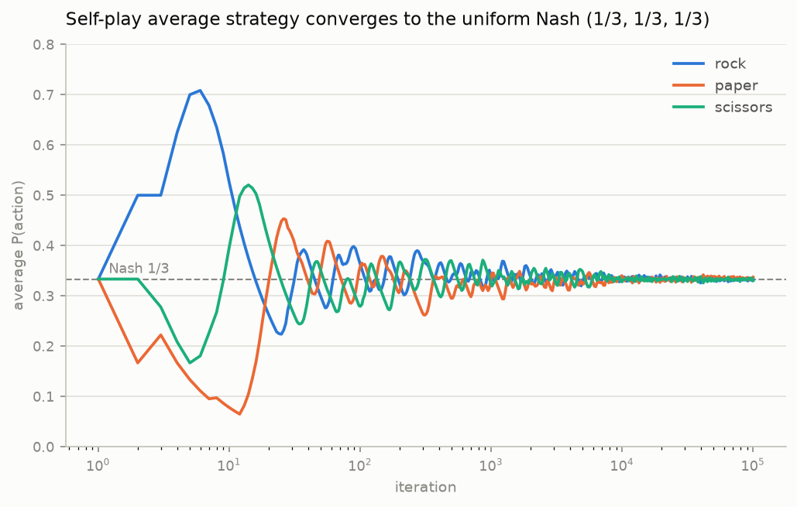
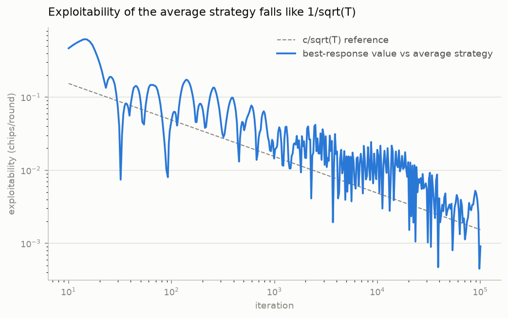

# Drawmaha Solver

A neural solver for heads-up pot-limit Drawmaha — a split-pot draw/Omaha hybrid poker variant with no existing solver — built with Deep CFR, plus a GTOWizard-style dashboard for exploring the solved game tree.

## The game

Standard Drawmaha, heads-up:

- Each player is dealt **5 hole cards**
- Preflop betting → **flop** → betting → **one draw** (discard 0–5, replace) → **turn** → betting → **river** → betting
- **Draw-1 rule:** drawing exactly one card gets dealt **face up** (public); the drawer may keep it or reject it and take the next card face down
- **Split pot:** half to the best Omaha hand (exactly 2 hole + 3 board), half to the best 5-card poker hand made of the hole cards themselves

Solve parameters (v1 defaults, all configurable): pot-limit with action set {fold, check/call, pot}; 100bb effective stacks; standard HU blinds. Bet-sizing menus are a config so multi-size/custom solves are a re-solve, not a rewrite.

## Approach: the validation ladder

Each rung adds one layer and is checked against a known answer before climbing:

| Rung | Game | What it proves |
|------|------|----------------|
| 0 | Rock-paper-scissors | regret-matching ledger math |
| 1 | Kuhn poker | tabular vanilla CFR vs. the known exact equilibrium |
| 2 | Leduc poker | CFR with a board, vs. published benchmarks |
| 3 | Mini-drawmaha | split-pot scoring, draw actions, face-up draw-1 rule (tabular MCCFR) |
| 4 | Full drawmaha | Deep CFR — neural nets replace the regret tables |

The dashboard queries the rung-4 average-policy network: navigate the tree node by node, see range-level strategy aggregates (bucketed — 2.6M starting hands don't fit in a grid) with drill-down to exact hands. A trainer mode (quiz spots against the solver) is a later thin layer on the same query API. PPO self-play is a planned extension chapter: train a PPO agent and measure the CFR solution exploiting it.

## Evaluation protocol (pre-registered)

Training loss is not a progress meter in self-play — the only honest question is what an adversary wins. Per rung: exact exploitability on the toys (checked against OpenSpiel reference values); on mini-drawmaha, the exact best-response walk as ground truth plus the Deep-CFR-vs-tabular gap; at full scale, a duplicate-dealt head-to-head checkpoint ladder plus a trained RL exploiter against the frozen net, reported as an exploitability lower bound. Units: total chips across both pot halves, per hand, in big blinds, with per-half EV and scoop rate as split-pot diagnostics.

## Rung 0 — RPS regret matching

`src/drawmaha_solver/rps/`: game rules and payoffs (`game.py`), players and the match runner (`players.py`), convergence analysis (`analysis.py`), and a human-vs-bot CLI (`play.py`). The regret-matching ledger itself lives one level up in `src/drawmaha_solver/regret_matching.py` — every rung uses it, and the learning rule never changes as the games grow.

```bash
uv sync
uv run pytest        # rules table, ledger math, convergence-to-Nash
uv run rps-analysis  # regenerates figures/rung0/
uv run rps-play      # play against the learner from the terminal
```

The ledger measures regret against its strategy's expected utility (u − ⟨σ, u⟩ — the same counterfactual form CFR uses at every infoset). Self-play average strategy reaches (0.334, 0.333, 0.333) after 100k iterations, exploitable for 0.0009 chips/round; against a 50%-rock opponent the ledger converges to pure paper and earns +0.24/round (best response: +0.25).





## Rung 1 — Kuhn poker, the game

`src/drawmaha_solver/kuhn/game.py`: the environment a solver iterates over, with no solver in it yet. Three-card deck (J < Q < K), both players ante 1, one card each, one round of betting with a single bet size of 1.

Every decision node offers exactly two actions, PASS and BET, so regret vectors stay uniformly 2-wide; what they *mean* depends on context, and `action_label` renders the poker word (a PASS is a check with nothing to call and a fold facing a bet; a BET is a bet or a call). The tree is 4 decision nodes and 5 terminals, listed explicitly rather than derived. `KuhnState` is frozen, so `apply` returns a new node and a tree walker never has to undo a move; `returns()` pays in chips with the ante as the unit — the ante on a fold or a checked-down showdown, ante plus bet when a bet is called.

`InfoSet` carries the acting player's own card and the public history, and deliberately *not* the opponent's card: two deals differing only in what the opponent holds must collapse to one equal, equally hashing key. The 12 infosets from `all_infosets()` are exactly the ledgers tabular CFR will allocate.

### The solver's memory

`src/drawmaha_solver/kuhn/infoset_table.py`: a `dict[InfoSet, RegretMatcher]` with all twelve ledgers pre-allocated, plus `current_strategy` / `average_strategy` readouts and a `format_strategy_grid` that prints P(BET) as the 4×3 grid. That dict is the entire persistent state of a Kuhn solve — twelve boxes of four numbers, 48 floats.

The shared ledger grows one thing for rung 1: `update(utilities, *, regret_weight, strategy_weight)`. In RPS every round counted the same; in a tree a visit is only reached sometimes, and the two accumulators want different scales — regret weighted by the *counterfactual* reach π₋ᵢ (chance and the opponent, excluding your own choices, so a line you currently avoid keeps learning at full strength), the average weighted by your *own* reach πᵢ. Both default to 1, so every rung-0 caller is untouched. Passing them swapped is the classic CFR bug and both versions run silently, so the weights are keyword-only and a test pins that the two scales are distinguishable.

### The walk

`src/drawmaha_solver/kuhn/cfr.py`: tabular vanilla CFR. In RPS the environment handed the ledger a utility vector straight out of a payoff-matrix column; a tree deletes that luxury, so the utilities have to be *computed*. Two quantities travel through `walk` in opposite directions — reach probabilities down (`reach[p]` is player p's own action probabilities, nothing else), node values up (plain conditional expectations, unweighted). The weights apply once, at the moment a ledger is banked. `walk` returns the value to both seats rather than to the player to act, so nothing is ever negated on the way up.

```bash
uv run pytest tests/kuhn   # payoff table, tree shape, infoset inventory, one
                           # traversal against a hand-worked trace, convergence
```

After 20,000 iterations the average strategy is the textbook answer sheet, printed by `format_strategy_grid` (each cell is P(BET), which means "call" on the two rows facing a bet):

```
             J       Q       K
     -   0.221   0.000   0.661     open:  bluff the jack, value-bet the king
     p   0.333   0.000   1.000
     b   0.000   0.341   1.000     call:  never fold the king, fold the jack
    pb   0.000   0.561   1.000
```

The solver finds α = 0.221 and K-open = 0.661 ≈ 3α: the jack bluffs exactly one third as often as the king value-bets, discovered from nothing. Game value to the first player is −0.05556 against Kuhn's closed-form −1/18. Because the equilibrium is a *family* over α ∈ [0, ⅓], the tests pin the nine determined infosets plus the two invariants (K-open = 3α, Qpb = α + ⅓) and never a hardcoded α̂; the game value is graded by an evaluator written independently of the solver, so the grader cannot share a bug with the graded.

Swap the two reach weights and the same run still completes, still reports a converged-looking grid, and folds the king to a bet 18% of the time — game value −0.00001 instead of −1/18. That failure mode is why the weights are keyword-only.

### The meter

`src/drawmaha_solver/kuhn/exploitability.py`: what a perfect adversary wins against a strategy, as `(BR₀ + BR₁) / 2` — zero exactly at Nash, positive everywhere else. Each player owns 6 infosets with 2 actions, so all 2⁶ = 64 of their pure strategies are enumerated and the best taken. Nothing is sampled: mixed strategies are handled by weighting both branches at every node, hidden cards by enumerating all six deals at 1/6, so these are exact expectations rather than estimates.

Written against `game.py` alone. It grades `cfr.py`, so it must not be able to share a bug with it — an error in the walk would otherwise appear in both and cancel, and the meter would certify the thing that broke it.

Enumerating *pure strategies over infosets* is also what keeps the adversary honest: a pure strategy names one action per infoset, fixed before any card is dealt, so "maximize per deal" — an opponent who sees your cards — is not expressible. That bug is not hypothetical; a test pins that a peeking meter would score a genuine Nash equilibrium at 0.278 chips/hand and send you hunting a bug in a correct solver.

| iterations | exploitability (average) | exploitability (current) | game value |
|---:|---:|---:|---:|
| 10 | 0.09114 | 0.24191 | −0.03597 |
| 100 | 0.02330 | 0.25000 | −0.05472 |
| 1,000 | 0.00650 | 0.27885 | −0.05518 |
| 10,000 | 0.00149 | 0.20359 | −0.05553 |
| 100,000 | 0.00063 | 0.24649 | −0.05555 |

Two things that table settles. The **average** strategy's exploitability falls steadily while the **current** strategy's sits around 0.2 forever and is briefly *worse* at 1,000 iterations than at 10 — vanilla CFR's current iterate cycles and never converges, which is why the dashboard at rung 4 must query the average-policy network and never the final iterate. And exploitability is the stricter grader: at 100 iterations the game value is already within 0.0009 of −1/18 and looks solved, while the strategy is still 15× more exploitable than it will be at 10,000.

## Status

Rung 0 complete. Rung 1 solves Kuhn to its closed-form equilibrium, reproduces the −1/18 game value, and reports exploitability against an exact best response. Next: the convergence figure and the rung-1 writeup.
