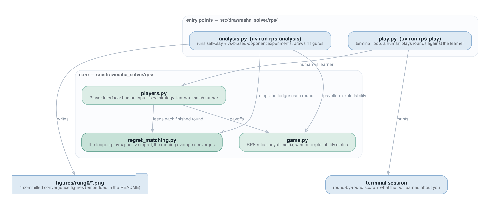
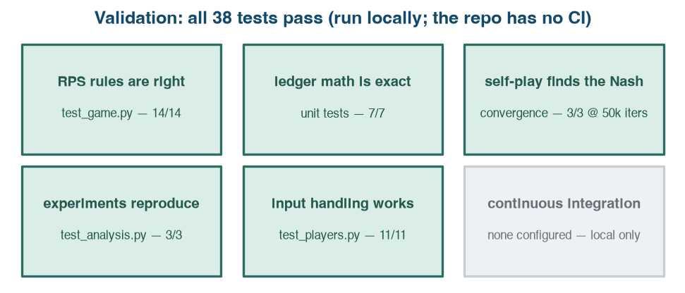
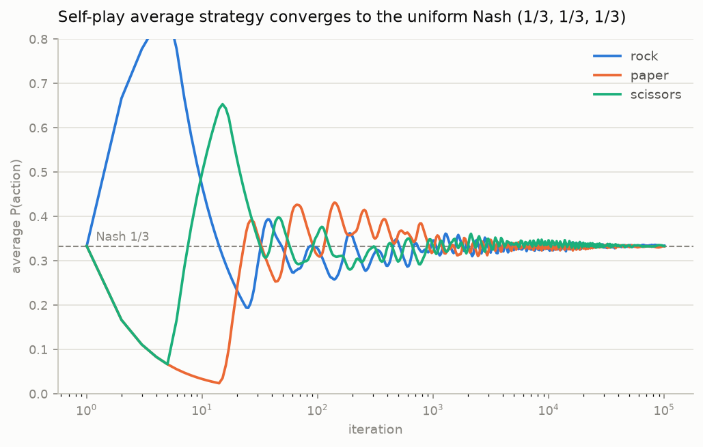

# Rung 0: RPS Regret Matching — Post-PR Writeup

*What actually shipped in PR #1 of drawmaha-solver, and how it fits together. Companion PDF: `rung0-rps-writeup.pdf`.*

## 1 Outcome & decision summary

The drawmaha-solver project is building a neural poker solver for heads-up Drawmaha (a split-pot draw/Omaha hybrid with no existing solver), developed as a ladder of five rungs where each rung adds one layer of complexity and is verified against a known answer before climbing. This PR ships **rung 0**: the *regret-matching* learning rule — the algorithm at the heart of every later rung — implemented on rock-paper-scissors, the smallest game with a known mixed-strategy equilibrium. It also establishes the Python package, test harness, and figure pipeline every later rung builds on.

**Outcome.** The learner provably works: starting from nothing, its average strategy converges to the known Nash equilibrium (⅓, ⅓, ⅓) — a best-responding adversary would win only 0.0009 chips/round off it after 100k iterations — and against a biased opponent it converges to the exploiting counter-strategy. **The ask: approve and merge PR #1 into `main`.** No migrations, no deploys, no ordering conditions. All 38 tests pass locally; the repository has no CI yet (flagged gray in §4, follow-up in §6). Verdict: **merge-ready**.

| PR | What it does | Size |
|----|--------------|------|
| [#1](https://github.com/AlecROndo/drawmaha-solver/pull/1) | Adds the rung-0 package: the RPS rules, the regret-matching learner, a match runner with human/fixed/learner players, a convergence analysis that certifies the learner finds the Nash equilibrium (four committed figures), and a terminal game to play against it. | 18 files, +1,310/−1 |

## 2 The algorithm, and the as-built map

Everything in this PR lives in one Python package plus its tests; the map below shows the two ways in and what they share. Four terms carry the whole document:

- **Regret** — after a round, for each action you *could* have played: how much better it would have scored than what you did. Play scissors into rock and your regret for paper is +2 (a loss becomes a win).
- **Regret matching** — the learning rule: next round, play each action with probability proportional to its accumulated *positive* regret (uniform if none is positive).
- **Current vs. average strategy** — the current strategy cycles forever and never settles; the theorem is that the *running average* of all strategies played converges to the Nash equilibrium. The average is the product.
- **Exploitability** — the score: how much a best-responding adversary who knows your strategy wins per round against it. Exactly 0 at the Nash equilibrium. This is the project's evaluation currency all the way up the ladder.

**Example.** The ledger after one round, starting uniform (⅓, ⅓, ⅓): the opponent shows paper, so the utility of each of our actions is (rock −1, paper 0, scissors +1). Our strategy's expected utility is 0, so the regret increments are the utilities themselves: (−1, 0, +1). Only scissors has positive regret, so the next round plays scissors with probability 1 — and the average strategy has banked one uniform round.

*The package as merged. Green = new code (everything is new at rung 0); blue = entry points and outputs. Two entry points branch into a shared core: the analysis CLI drives the ledger directly; the play CLI goes through the player layer; both converge on the ledger and the rules.*

## 3 How it works

One PR, five modules, walked in the diagram's causal order. Per file: what it is, then the facts that matter.

**`src/drawmaha_solver/rps/game.py`** — the rules of RPS, and the measuring stick.
- The payoff matrix (`PAYOFF[a, b]` = row player's chips) is the single source of truth; it is zero-sum and antisymmetric by construction `src/drawmaha_solver/rps/game.py:32`
- `winner(a, b)` derives win/loss/tie from the matrix, never from a second rules table `src/drawmaha_solver/rps/game.py:44`
- `best_response_value(strategy)` is the exploitability metric — the project's first evaluation instrument `src/drawmaha_solver/rps/game.py:61`
- Actions are an `IntEnum` so they index payoff matrices and strategy vectors directly `src/drawmaha_solver/rps/game.py:21`

**`src/drawmaha_solver/rps/regret_matching.py`** — the learner: one ledger, ~40 lines, the heart of the project.
- `strategy()` normalizes positive accumulated regrets; all-negative regrets fall back to uniform `src/drawmaha_solver/rps/regret_matching.py:36`
- `update(utilities)` accumulates regret against the strategy's *expected* utility (u − ⟨σ, u⟩) and banks the strategy into the running average `src/drawmaha_solver/rps/regret_matching.py:51`
- `average_strategy()` returns the running average — the object that converges `src/drawmaha_solver/rps/regret_matching.py:44`
- A one-action ledger is rejected loudly rather than degenerating silently `src/drawmaha_solver/rps/regret_matching.py:31`

**Decision.** The ledger measures regret against the strategy's expected utility, not against the sampled action (the textbook RPS-trainer variant) — *because* u − ⟨σ, u⟩ is exactly the counterfactual-regret form CFR uses at every information set, so rung 1 changes nothing about the update rule, and it is lower-variance: final exploitability 0.00091 chips/round vs 0.00443 for the sampled form on the same budget. Don't "simplify" it back.

**`src/drawmaha_solver/rps/players.py`** — the glue: who plays, and how rounds flow.
- `Player` is a two-method interface: `act(rng)` and `observe(own, opp)` `src/drawmaha_solver/rps/players.py:19`
- `RegretMatchingPlayer.observe` feeds the ledger `PAYOFF[:, opp]` — the utility of every action against the opponent's revealed move `src/drawmaha_solver/rps/players.py:53`
- `FixedStrategyPlayer` rejects any input that is not a probability distribution `src/drawmaha_solver/rps/players.py:37`
- `play_match(p0, p1, *, n_rounds, rng)` runs rounds, shows both players the result, returns player 0's payoffs `src/drawmaha_solver/rps/players.py:85`

**`src/drawmaha_solver/rps/analysis.py`** — the certification: experiments + the four committed figures.
- `run_self_play` records, per iteration, the current strategy, the running average, and the average's exploitability `src/drawmaha_solver/rps/analysis.py:98`
- `run_vs_fixed` pits the learner against a fixed 50%-rock opponent `src/drawmaha_solver/rps/analysis.py:121`
- Results travel as frozen dataclasses (`SelfPlayTrajectories`, `VsFixedTrajectories`), not loose dicts `src/drawmaha_solver/rps/analysis.py:49`
- Four figures (average-strategy convergence, current-vs-average cycling, log-log exploitability decay, best-response learning) write to `figures/rung0/` `src/drawmaha_solver/rps/analysis.py:139`

**`src/drawmaha_solver/rps/play.py`** — the demo: `uv run rps-play` is a terminal loop against the learner; on quit it prints the bot's learned average strategy — against a habit-prone human it visibly drifts toward the counter `src/drawmaha_solver/rps/play.py:10`.

## 4 Test results

All 38 tests pass, run locally on this branch (`uv run pytest`, 1.4s). Every count below is paired with what it proves; the one gray tile is the absence of CI, not a failing check.

- **14 rules tests** prove the game itself is right: all 9 action-pair outcomes pinned individually, the payoff matrix verified zero-sum, and the exploitability metric anchored at both extremes (uniform → 0, pure rock → 1) plus a hand-computed midpoint.
- **7 ledger unit tests** prove the math is exact, not just plausible: hand-computed regret increments for the expected-utility update, the positive-regret normalization, the uniform fallback, and the average-strategy arithmetic.
- **3 convergence tests** prove the theorem shows up in practice: 50k-iteration self-play lands within 0.02 of the uniform Nash with exploitability < 0.02 for *both* players; against a 50%-rock opponent the average goes > 90% paper and the realized winnings beat +0.1/round; identical seeds reproduce identical matches.
- **3 analysis tests** prove the certification pipeline reproduces: trajectory shapes, exploitability falling over time, and all four figure files actually written.
- **11 input-handling tests** prove the boundary is defended: non-distributions rejected, r/p/s and full words parsed, garbage reprompted, quit raised cleanly.

Headline numbers from the committed 100k-iteration run: self-play average strategy (0.334, 0.333, 0.333), exploitable for **0.00091 chips/round**; against 50% rock the learner's average is 99.9% paper earning **+0.237/round** (the theoretical best response earns +0.25).

*What convergence actually looks like: each action's average probability (log-scale iterations) swinging early, then locking onto the ⅓ line. The other three committed figures show the current strategy cycling forever, the 1/√T exploitability decay, and the best-response convergence.*

## 5 Edge cases & handling

| Case | Status | Where handled |
|------|--------|---------------|
| One-action ledger (degenerate game) | handled — raises | `src/drawmaha_solver/rps/regret_matching.py:31` |
| All regrets negative (no positive signal) | handled — uniform fallback | `src/drawmaha_solver/rps/regret_matching.py:40` |
| Player given a non-distribution strategy | handled — raises with the offending value | `src/drawmaha_solver/rps/players.py:37` |
| Garbage terminal input | handled — reprompts | `src/drawmaha_solver/rps/players.py:79` |
| Quit before playing any round | handled — no summary printed | `src/drawmaha_solver/rps/play.py:38` |
| Analysis run shorter than the 5,000-iteration plot window | handled — window clamps | `src/drawmaha_solver/rps/analysis.py:156` |
| `update()` given a wrong-length utilities vector | **known gap** — numpy raises, but only *after* the strategy was banked, leaving the ledger half-updated | `src/drawmaha_solver/rps/regret_matching.py:51` |

The known gap is accepted at rung 0 (the only callers are in-repo and tested); harden the `update` boundary when the API grows callers at rung 1.

## 6 Risks & follow-ups

**Risk.** Nothing guards `main`: the repository has no CI, so these 38 tests run only when someone runs them — a future PR could break the ladder's foundation silently → add a GitHub Actions `uv run pytest` workflow before rung 1 lands.

- **Convergence tests are seed-pinned** — a numpy RNG behavior change could flip a threshold → `uv.lock` is committed and pins numpy; keep it that way.
- **README numbers and figures regenerate only manually** — if the ledger changes, `uv run rps-analysis` must be re-run or the committed figures drift from the code → one command, but a human has to remember it.
- **The interactive play loop has no test of its own** — input *parsing* is tested (11 tests), the `play.main()` round loop is exercised only by hand.
- **Deferred (by design):** rung 1 — tabular CFR on Kuhn poker against the known exact equilibrium — is the next step; nothing in this PR blocks or presupposes its shape beyond the update rule deliberately matching CFR's.

## 7 Validation & merge-readiness gate

| Gate | Status | Note |
|------|--------|------|
| Branch / commits | `alec/rung0-rps` (983066b, 623b96b) | PR [#1](https://github.com/AlecROndo/drawmaha-solver/pull/1) |
| Merge conflicts | none | `mergeable: MERGEABLE`, state `CLEAN` |
| CI / checks | n/a | no CI configured on this repository (§6 follow-up) |
| Tests (local) | 38/38 pass | `uv run pytest`, verified on the PR tip |
| Review | 0 open | no human review yet; single-author repository |
| Migrations / deploy conditions | none | pure library + CLI code |

**Bottom line: safe to merge as-is;** the only outstanding items are the no-CI follow-up and the one known gap, both accepted for rung 0.
